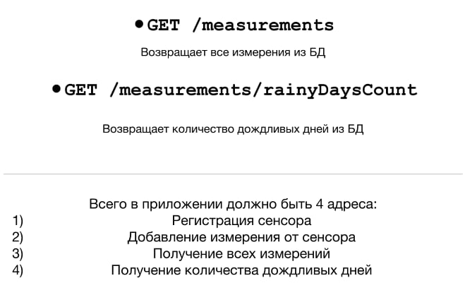
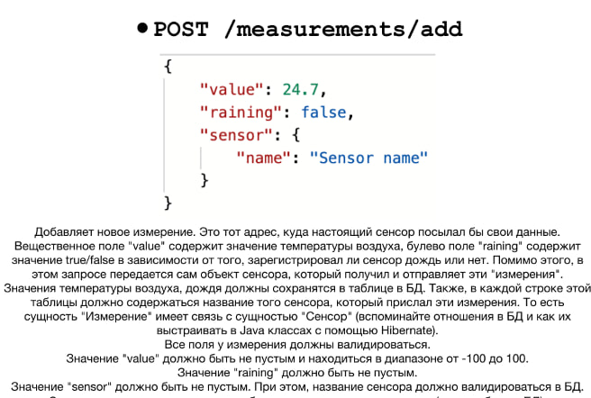
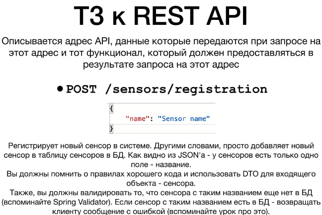
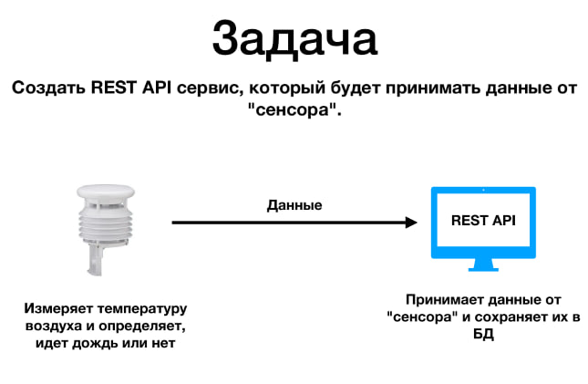

```markdown
# WeatherAPI

**WeatherAPI** is a REST API application for working with sensor data that records air temperature and rain status. The application allows you to register sensors, add measurements, and retrieve statistics, including the number of rainy days. The project was completed as part of a training assignment.

---

## Features

- **Sensor Registration**: Add a new sensor to the database.
- **Adding Measurements**: Record temperature data, rain status, and sensor identification.
- **Getting All Measurements**: Access all recorded measurement data.
- **Getting the Number of Rainy Days**: Calculate the number of days with rain.
- **Relationship between tables one to many, has validation, you cannot add measurement with undefined sensor**.

---

## Installation and Running Instructions

### 1. Clone the Repository
Clone the repository or download the project files:
```bash
git clone https://github.com/kai713/WeatherAPI.git
```

### 2. Configure the Database
1. Ensure PostgreSQL is installed and running.
2. Create a new database:
   ```sql
   CREATE DATABASE weatherAPI (project3 in my case);
   ```
3.Craete two tables measurements and sensors, relationship between them one to many
4. Open the `application.properties` file and configure your database connection:
   ```properties
   spring.application.name=Project3

spring.datasource.driver-class-name=org.postgresql.Driver
spring.datasource.url=jdbc:postgresql://localhost:5432/project3
spring.datasource.username=yourusername
spring.datasource.password=yourpassword

spring.jpa.properties.hiberntate.dialect=org.hibernate.dialect.PostgreSQLDialect
spring.jpa.properties.hibernate.show_sql=true

spring.mvc.hiddenmethod.filter.enabled=true
spring.jpa.hibernate.ddl-auto=updated
   ```

### 3. Run the Application
Use Maven to build and run the application:
```bash
mvn spring-boot:run
```

---

## API Endpoints

### 1. **POST** `/sensors/registration`
**Description**: Registers a new sensor in the system.

- **Request Body**:
  ```json
  {
    "name": "Sensor name"
  }
  ```

- **Response**:
  - `201 Created`: Sensor successfully registered.
  - `400 Bad Request`: A sensor with this name already exists.

---

### 2. **POST** `/measurements/add`
**Description**: Adds a new measurement from a registered sensor.

- **Request Body**:
  ```json
  {
    "value": 24.7,
    "raining": false,
    "sensor": {
      "name": "Sensor name"
    }
  }
  ```

- **Response**:
  - `201 Created`: Measurement successfully added.
  - `400 Bad Request`: Validation error or unregistered sensor.

---

### 3. **GET** `/measurements`
**Description**: Retrieves all measurements from the database.

- **Example Response**:
  ```json
  [
    {
      "value": 24.7,
      "raining": false,
      "sensor": "Sensor name",
      "timestamp": "2023-11-25T10:00:00Z"
    },
    {
      "value": 18.2,
      "raining": true,
      "sensor": "Sensor name",
      "timestamp": "2023-11-24T14:00:00Z"
    }
  ]
  ```

---

### 4. **GET** `/measurements/rainyDaysCount`
**Description**: Returns the count of rainy days recorded by the system.

- **Example Response**:
  ```json
  {
    "rainyDaysCount": 15
  }
  ```

---

## Technologies Used

- **Java**: Backend programming language.
- **Spring Boot**: Framework for building REST APIs.
- **PostgreSQL**: Relational database for storing sensor and measurement data.
- **Hibernate**: ORM framework for database interaction.
- **Maven**: Dependency management and build tool.
- **Spring Data**: Framework for database.

---

## Screenshots









---

